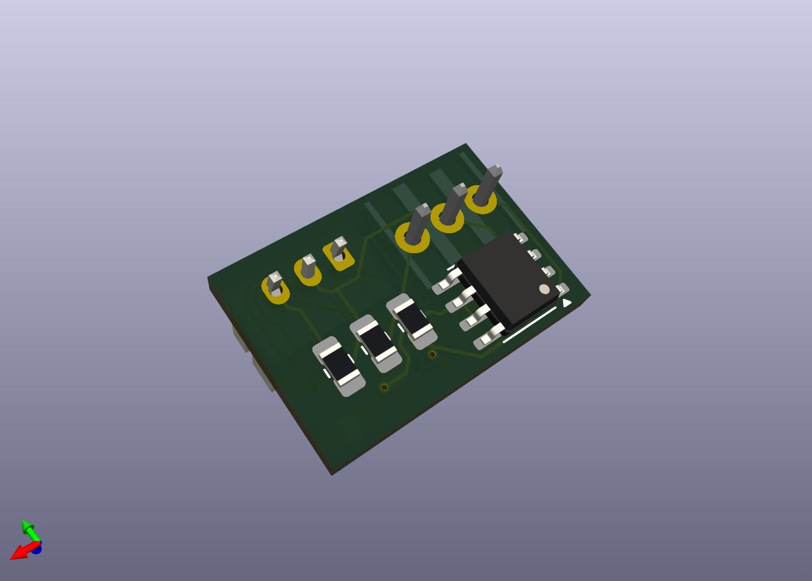

# FanPWMtoRotorLock
Utilizes a missing pulse detector based on the circuitry [here](https://www.falstad.com/circuit/e-555missing.html) to convert the output from a 12v PWM fan to a rotor lock detector signal.

## BOM

- 1 10uf Capacitor SMT 08051 Molex 022232031 Connector
- 1 JST-PH2.0MM Connector
- 1 MMBT2222A-7-F SOT-23 NPN Transistor
- 1 MMBT2907ALT1G SOT-23 PNP Transistor
- 5 10K Ohm Restor SMT 0805
- 1 100 Ohm Resistor SMT 0805
- 1 NE555P SOIC-8 Timer

## Images

    
    

